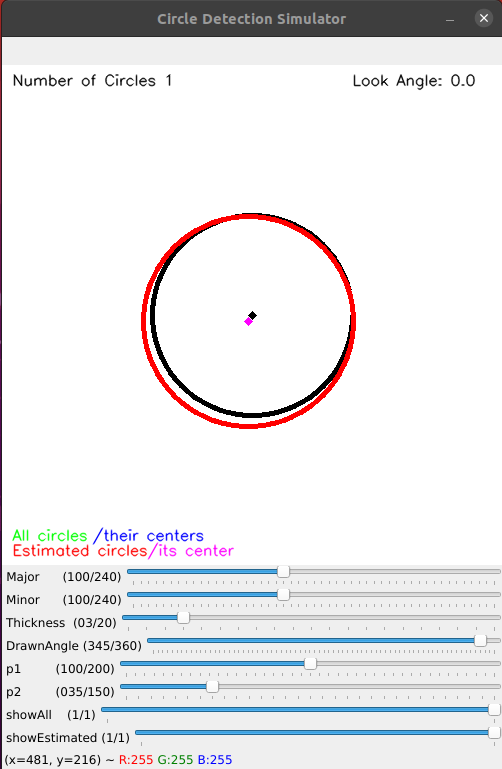
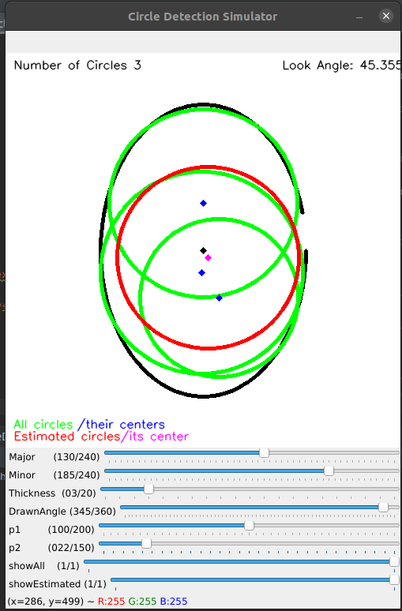

# Circle-Ellipse-Detection-Simulator
Program to detect the circles and ellipses livelily. Parameters and ellipse shape are changeable while running time.

In the 3D world, if you look at a circle from different angles, you may see the circle as an ellipse. But it is still a circle.
So to detect a circle from different look angles, center coordinates are very important.

This program will detect all possible circles and will calculate one estimated circle. The center coordinates are so close,
but the radius sometimes doesn't work as expected.

If you desire to learn center, you can close the showAll parameter and can look to the pink point.
I limited the minor length because of my special case. You can delete the second if condition in the code.

Hint: To detect more circles reduce p2.

